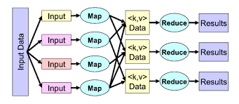

# MapReduce

Traditional Sequential Algorithms for solving a lot of problems show limitations on efficiency and speed as the Problem data set gets larger and larger.
With this in mind, a lot of different strategies have been developed to increase efficiency and decrease the computational time for such problems and most of these approaches are mainly found in the field of parallel computing.
In this sense, several Algorithms tend to stand out, and the **MapReduce** approach is one of them.

MapReduce is a very appealing approach in the field of parallel and distributed computation due to its innovative approach to large-scale network problems.

Here is my simplified implementation of the Algorithm.

# Description

---

This Project is a simplified version of the [**Map-Reduce Framework**](https://en.wikipedia.org/wiki/MapReduce).
Simplified in the sense that it is not meant to be executed in a distributed file environment with multiple map/reduce workers distributed over a network, but mainly just a blueprint on how the Framework works, and with the help of multithreading I could
reproduce the idea of multiple map/reduce workers working together on a different part of the input file set to produce an output.

The Framework has been adopted by the Industry as an efficient solution to many problems with very large Data sets. One of which includes the **Single destination shortest Path Problem** .

With the help of this [paper](https://journalofbigdata.springeropen.com/articles/10.1186/s40537-018-0125-8), I was able to adapt the framework to solve this problem using Dijkstra BFS Algorithm.

# Algorithm
---

